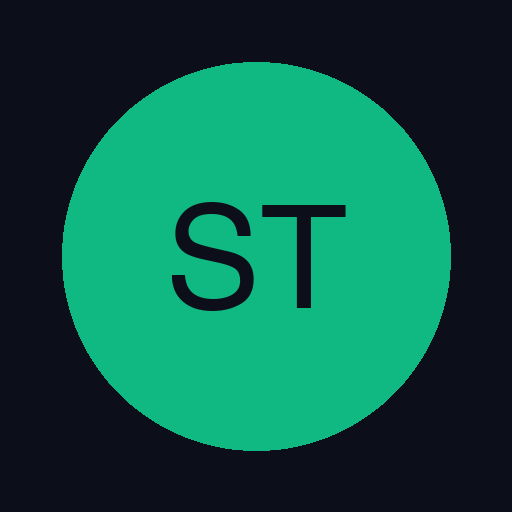

# Diluizione Spese Tech

Tracker per l'ammortamento degli acquisti tecnologici. Calcola il costo giornaliero di ogni prodotto e mostra il progresso verso la soglia di 0.25€/giorno.



## Funzionalità

- **Dashboard KPI**: spesa totale attiva, costo medio/giorno, prodotti ammortizzati, prossimo traguardo
- **Grafici**: ranking costo/giorno e spesa per categoria
- **Gestione prodotti**: aggiungi, modifica, ritira, elimina
- **Filtri e ordinamento**: per stato, categoria, costo/giorno, prezzo, durata, progresso
- **Sezione ritirati**: statistiche dettagliate sui prodotti ritirati
- **Import/Export**: JSON e CSV
- **Sincronizzazione**: tramite GitHub Gist privato
- **PWA**: installabile su iOS, Android e desktop, funziona offline

## Setup sincronizzazione

### 1. Crea un Personal Access Token GitHub

1. Vai su [github.com/settings/tokens](https://github.com/settings/tokens)
2. Clicca **"Generate new token (classic)"**
3. Seleziona lo scope **`gist`**
4. Copia il token generato

### 2. Configura nell'app

1. Clicca l'icona ⚙️ nell'header
2. Incolla il token nel campo "Token PAT"
3. (Opzionale) Inserisci un Gist ID esistente
4. Clicca **"Configura"**

L'app creerà automaticamente un Gist privato se non ne fornisci uno.

## Installazione come PWA

### iOS (Safari)
1. Apri l'app nel browser
2. Tocca il pulsante **Condividi** (quadrato con freccia)
3. Seleziona **"Aggiungi alla schermata Home"**

### Android (Chrome)
1. Apri l'app nel browser
2. Tocca il menu ⋮
3. Seleziona **"Installa app"** o **"Aggiungi a schermata Home"**

### Desktop (Chrome/Edge)
1. Apri l'app nel browser
2. Clicca l'icona di installazione nella barra degli indirizzi
3. Conferma l'installazione

## Struttura del progetto

```
diluizione-spese-tech/
├── index.html          # App completa (HTML + CSS + JS inline)
├── manifest.json       # PWA manifest
├── sw.js               # Service worker per offline
├── icons/
│   ├── icon-192.png    # Icona 192x192
│   └── icon-512.png    # Icona 512x512
└── README.md
```

## Privacy

- Il sito su GitHub Pages è pubblico, ma **non contiene dati personali**
- I dati dei prodotti risiedono nel **localStorage** del browser e/o in un **Gist privato** del tuo account GitHub
- Il token GitHub viene salvato solo nel localStorage del browser e non viene mai trasmesso a terzi
- Nessun dato viene inviato a server esterni (eccetto GitHub API per la sync)
